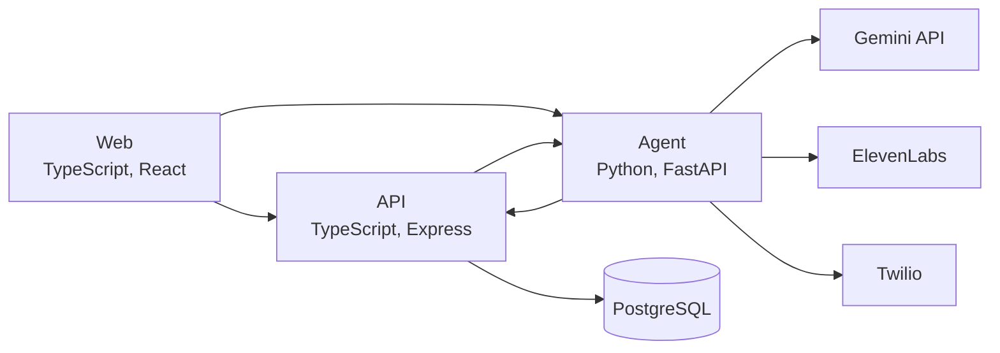

# Honkler

Honkler is a voice agent that calls a company's customer service line and negotiates a lower monthly bill on the user's behalf. Users upload a bill, Gemini extracts the provider and builds a negotiation plan, an ElevenLabs voice agent places the call over Twilio, and the project won Best Use of ElevenLabs at Hack Hack Goose 2026.

